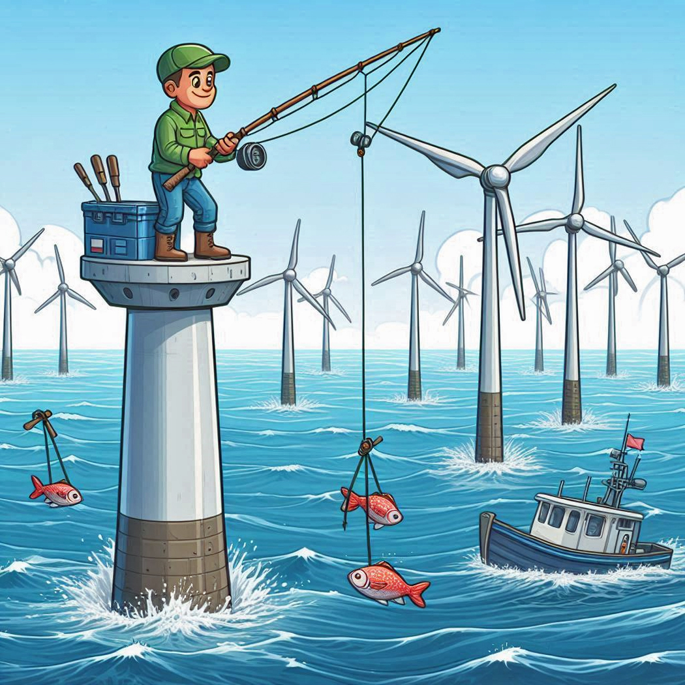

# Wind Turbine Project

{width="250"}

Welcome to the project repo for the Wind Turbine Project. The Wind Turbine project is being done to meet the requirements of GEOG 463/563 at Oregon State University during the spring term of 2025. This repository will contain all the code and data we gather to build and implement the data analysis system supporting the project, notes our weekly 1:1s, and copies of the paper we write to report on our results. To learn more about the course, visit the ([Analytic Workflows Repo](https://github.com/Analytical-Workflows-for-Earth-Science/Sp2025){.uri}).

## Project Description

Oregon is considering installing floating wind turbine farms off the Oregon coast as part of its electrical grid. The decision is complicated by the fact that there are costs to deploying wind turbines that offset the benefit of the clean electricity. Beyond the direct cost of the turbine farms, there are impacts on tourism and views, on whales, on fisheries, and so on.

The benefits and costs of wind turbines depend on their location. The project aims to make benefits and costs explicit and to implement a spacial optimization system that can maximize the "profits" (benefits minus costs) of turbine farm location strategies. The initial effort in GEOG 463/563 aims to compare electricity generated and fishery output measured in dollar values and produce optimal location strategies based on these dollar values. Our implementation will try to factor out electricity benefits and fishery impacts from the optimization framework so that it will be easier to add other costs/impacts of turbine farms in subsequent analyses.

## Project Stages

In order to implement the project, the team will accomplish the following tasks:

1)  Set up the relevant infrastructure (Trello, Slack, Git & GitHub, shared file system, R & RStudio)
2)  Do a literature search to identify 10-20 papers that will teach us about the subject area. Focus on data sets that can get us up and running quickly. Save simple summaries of interesting articles in our repo.
3)  Collect, clean, wrangle, analyze, and describe the data. Use R and Excel as necessary. Create metadata describing the data set. Write a data summary document that includes visualizations.
4)  Build an R system that optimizes a sum of positive benefits and negative costs relative to the locations of wind turbine systems. Write it in such a way that it will be as easy as possible to add more cost considerations in the future.
5)  Document the process in two ways: keep weekly notes of our 1:1 meetings, and then write a 10-15 page paper explaining our results.

## Project Schedule

| **Week** | **Infrastructure** | **Bibliography** | **Data Sources** | **Optimization** | **Paper** |
|------------|------------|------------|------------|------------|------------|
| 1 (4/04) | Started, Learning |  |  |  |  |
| 2 (4/11) | Learning, Ready |  |  |  |  |
| 3 (4/18) |  | Search Started | Search Started |  |  |
| 4 (4/25) |  | Search finished | Wrangling |  | Draft Bibliog... |
| 5 (5/02) |  |  | Notebooks ready | Design Ready | Draft Data |
| 6 (5/09) |  | More as needed |  | In Progress | Draft Strategy |
| 7 (5/16) |  |  | More as needed | Beta Ready | Draft Code Desc. |
| 8 (5/23) |  |  |  | Debugging | Draft |
| 9 (5/30) |  |  |  | Ongoing |  |
| 10 (6/06) | BUFFER | BUFFER | BUFFER | BUFFER | BUFFER |

See ([our Trello site](https://trello.com/b/Z67GFNTV/wind-turbine-project){.uri}) for more detail.
